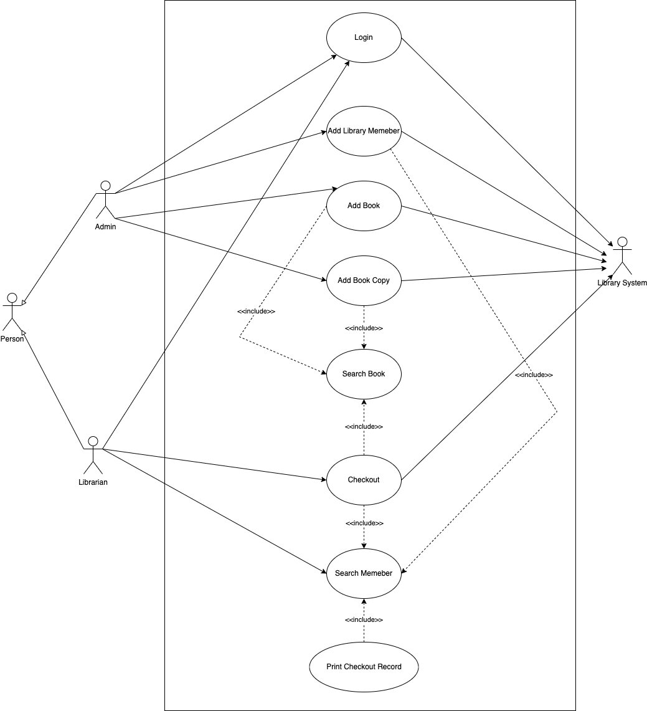
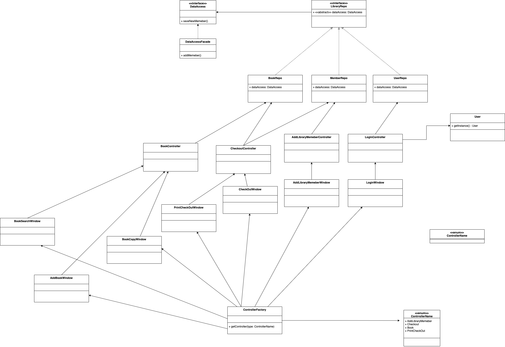
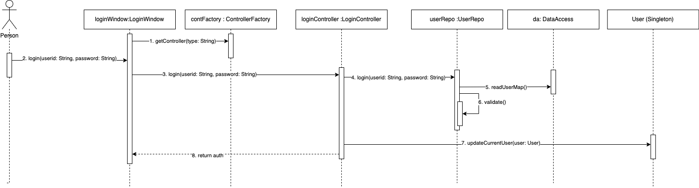
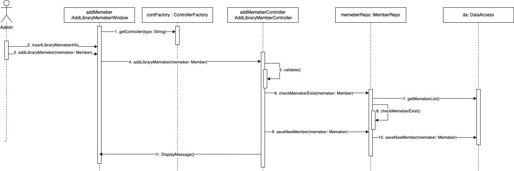
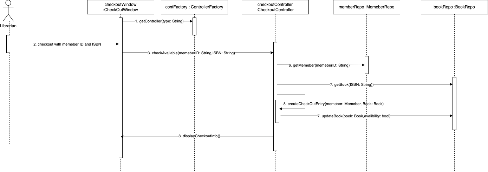
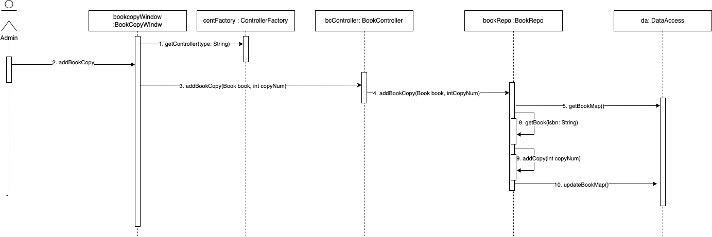
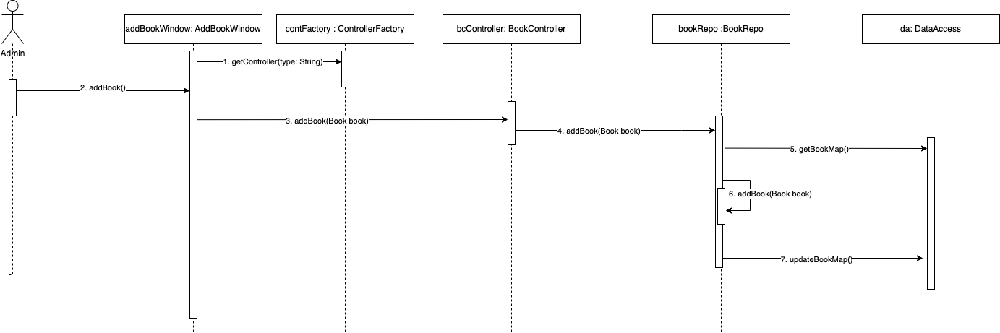
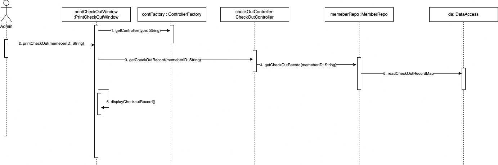
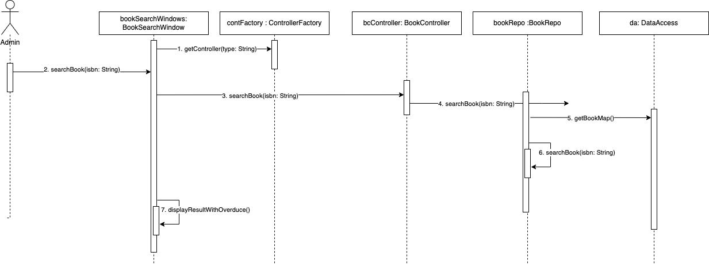

# MPP Library Project
## Professor : Assad Maalouf

# Use Case

# System Design

- MVC Pattern
- Factory Pattern
- Use Case Controller Pattern
- Repository Pattern

# UML

# Sequence Diagram

## Login

## Add Library Memeber

# Checkout

# Book Copy

# Create Book

# Print Checkout Records

# Searching Book (Overduce)

